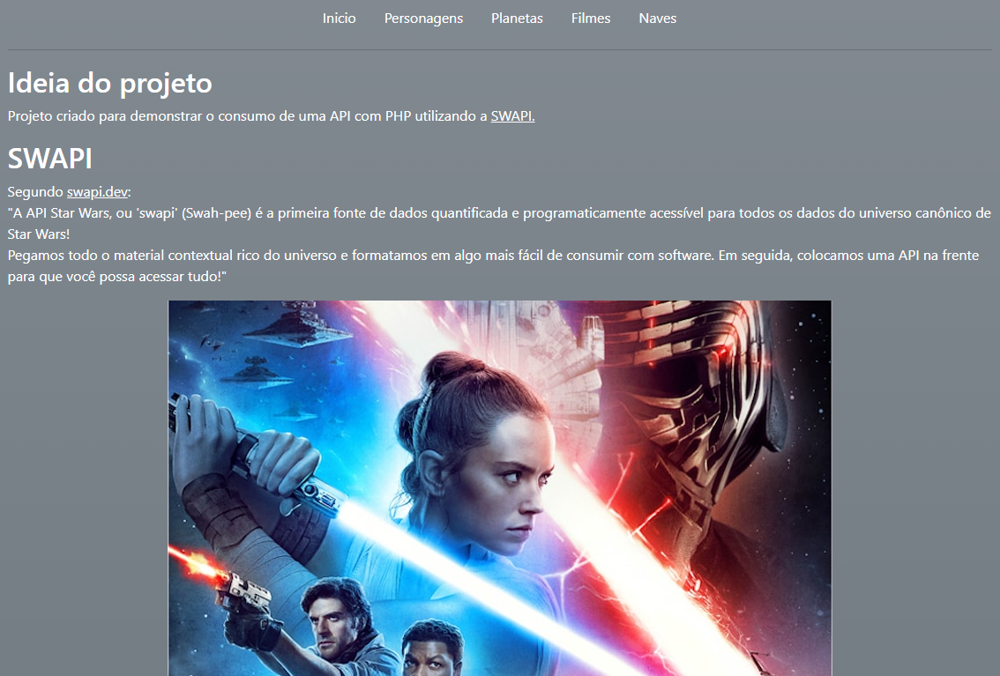
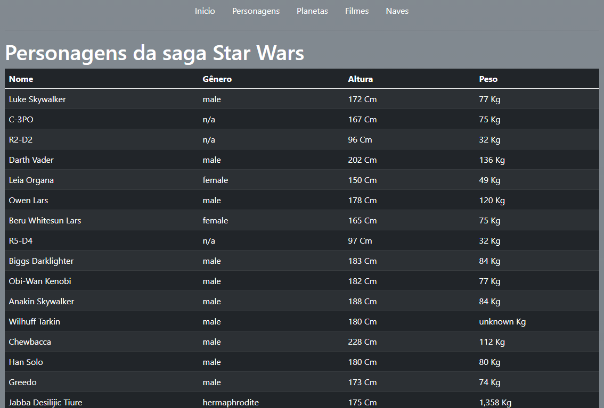
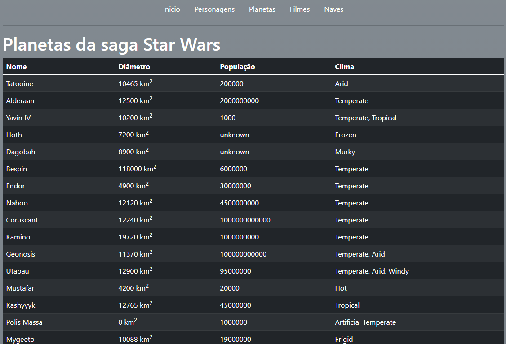
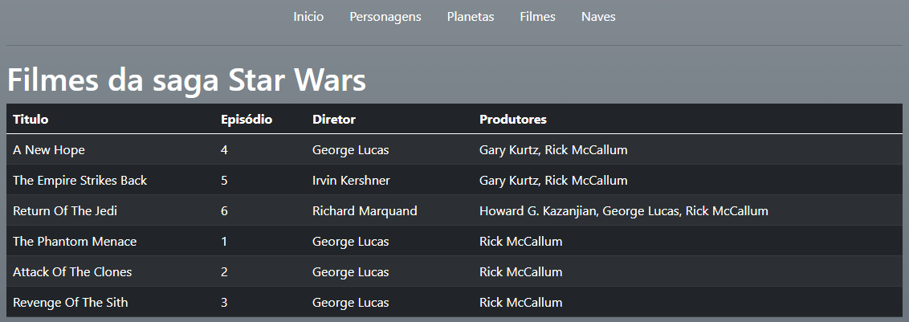
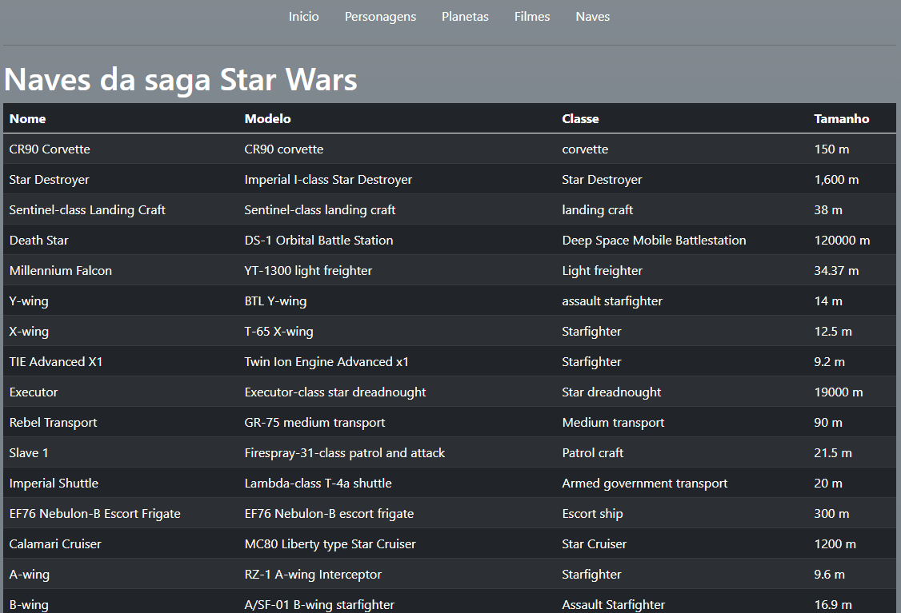

# Consumo de API's

Este projeto tem como proposito demonstrar o consumo de API's utilizando da linguagem de programação PHP.

A API escolhida para demonstrar este recurso foi a SWAPI, uma fonte de dados com informações sobre o univeso cinematografico de Star Wars.

> Mais informações em [swapi.dev](http://swapi.dev).

Neste projeto foi coletado com proposito didatico informações sobre: Personagens, planetas, espaçonaves e filmes. As informações foram divididas em 5 páginas apresentadas a seguir:

# Inicio

Página principal, contém na parte superior um menu de navegação (presente em todas as páginas) e logo abaixo apresenta a proposta e detalhes do projeto.

# Personagens

Apresenta uma lista de personagens coletados da API, exibindo caracteristicas como: Nome, gênero, altura e peso.

# Planetas

Apresenta uma lista de personagens coletados da API, exibindo caracteristicas como: Nome, diâmetro, população e clima.

# Filmes

Apresenta uma lista de filmes coletados da API, exibindo caracteristicas como: Título, episódio, diretor e produtores.

# Espaçonaves

Apresenta uma lista de filmes coletados da API, exibindo caracteristicas como: Nome, modelo, classe e tamanho.

